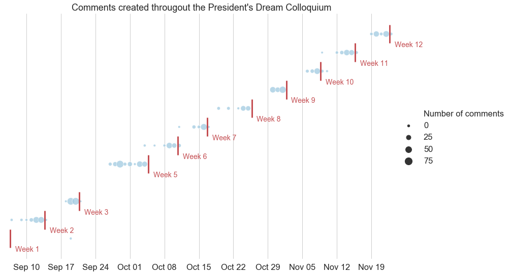
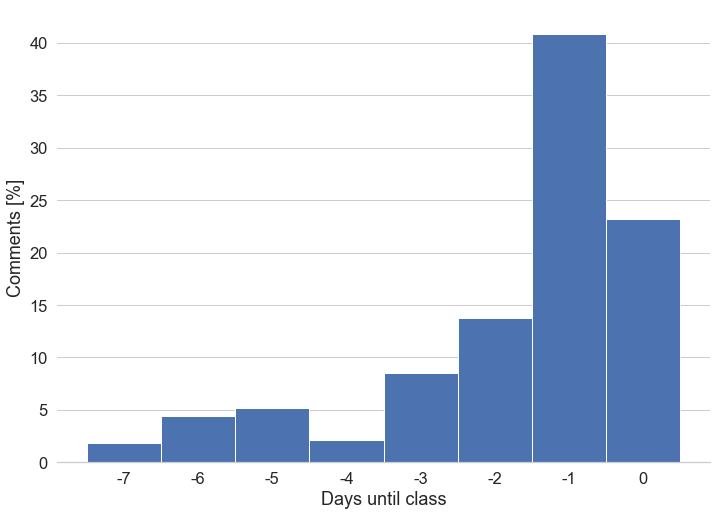
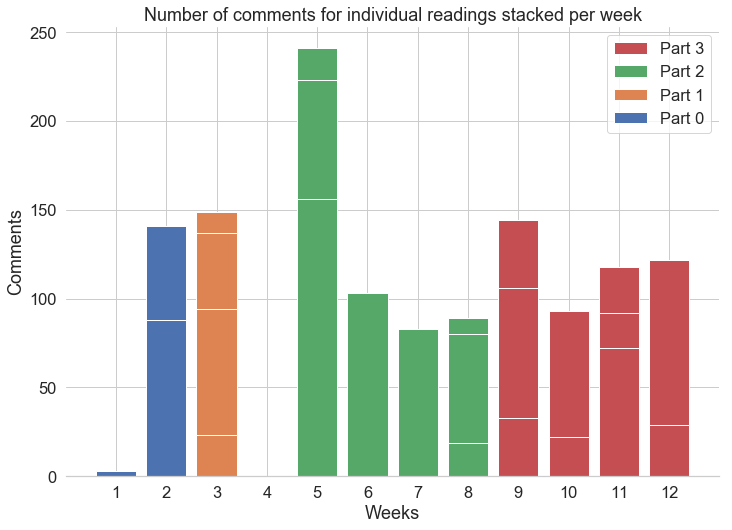
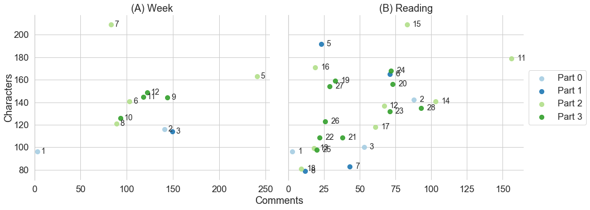
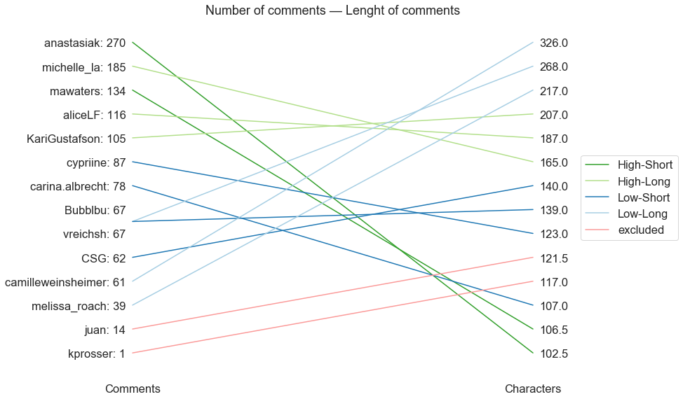
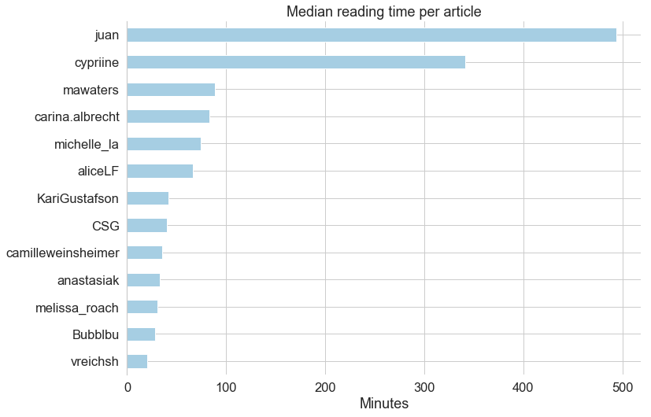
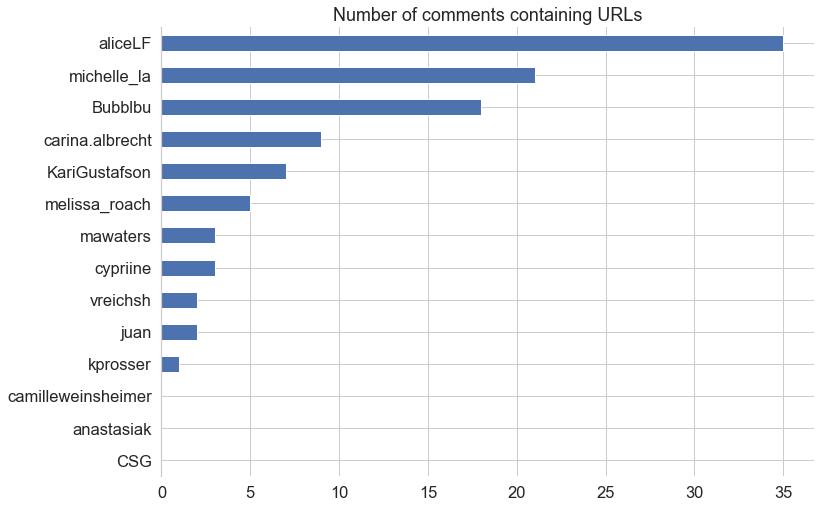
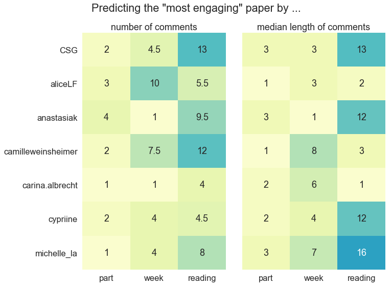

# [MKP] - Hypothesis, Annotations, and Engagement

> An Exploration of public annotiations made during the #publicknowledge course during the Fall term 19' at SFU

Author: Asura Enkhbayar
Date: 05.12.2018

## Materials

- Full Jupyter notebook including code for analysis and plots: [notebook](code/results.ipynb)
- Presentation used for the last class of the course: [link](http://htmlpreview.github.io/?https://github.com/Bubblbu/public-knowledge-annotations/blob/master/code/presentation.html)
- Detailed survey results: [spreadsheet](data/survey.csv)
- About Hypothesis: [homepage](hypothes.is)

## The Data Sources

The data used for this analysis comes from three different sources.

### 1. Making Knowledge Public - Course Material

The course structure and outline as described on the [syllabus](scholcommlab.ca/publicknowledge) has been manually saved in spreadsheets.

### 2. Survey among students

A survey among students was used to (1) identify and confirm Hypothesis usernames needed to differentiate comments relevant to the course and annotations created by other public users.

### 3. Our annotations retrieved from Hypothesis API

Hypothesis provides an API to programmatically retrieve annotation data for individual URLs. The URLs to the readings were available in the course material. The API returns the total number of annotations for each URL and a list of annotation object. Each annotation contains among other things:

- A unique ID for this annotation
- Date created
- Date updated
- The full text of the comment
- References (other annotations that this object was a reply to)
- The username of the author

## The Data

In total, the course consisted of 12 weeks and 28 annotated readings. Hypothesis found 1431 annotations for these 28 URLs, while 24 of these were created before the first class of the PDC. Of the 1417 annotations that were created during the 12 weeks, 1286 (91%) were created by students of this course.

9 students filled out the [survey](data/survey.csv), while 7 provided a complete set of answers.

> **_1286 annotations_ created by _14 students_ (and Juan) during _12 weeks_ of classes on _28 readings_.**

## What can we learn from the data?

Given that the data from Hypothesis was available, I decided to use this chance to explore the notions of annotations & engagement within the context of the President's Dream Colloquium.

In the following section I will present a few initial insights and attempts to think about the meaning of annotation papers.

### When did students annotate?
Hello test test

<em>Fig.1: Overview of comments during the PDC.</em>

<figure align="center">
  
  <figcaption>Fig.2: Number of days before a class that.</figcaption>
</figure>

<em>Fig.2: Number of days before a class that</em>

### How did students annotate?

**Some other insights...**

### Predicting engagement with annotations

## Other Questions

- Interaction with other users

## Contact

I would love to hear about your thoughts and other ideas for further analyses. Feel free to submit a [new issue](https://github.com/Bubblbu/public-knowledge-annotations/issues/new) or simply shoot me a text at [asura.enkhbayar@gmail.com](mailto:asura.enkhbayar@gmail.com).

## License

 This work is licensed under a <a rel="license" href="http://creativecommons.org/licenses/by/4.0/">Creative Commons Attribution 4.0 International License</a>.