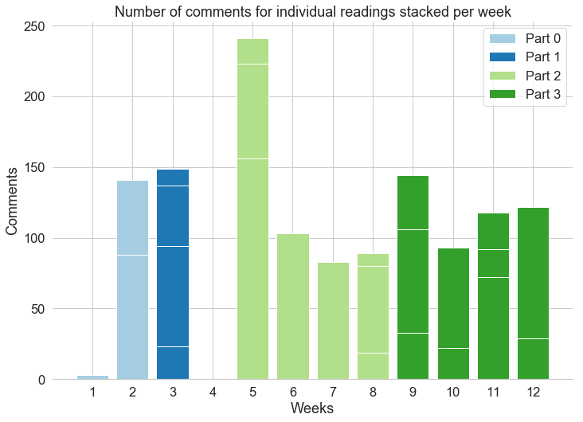
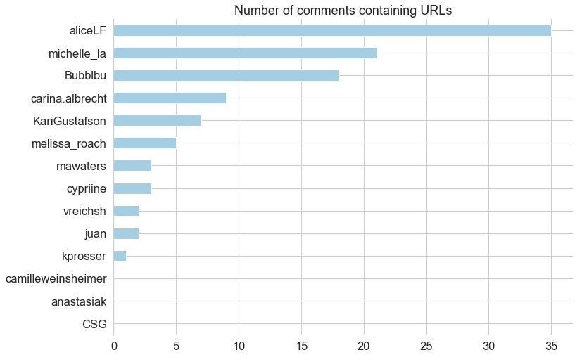

# Engaging Annotations or Annotating Engagement?

> Experiencing the metrics hype first hand

This year's President's Dream Colloquium on [**_Making Public Knowledge_**](https://www.sfu.ca/dean-gradstudies/events/dreamcolloquium/DreamColloquium-making-knowledge-public.html) at SFU was all about the public aspects of knowledge production and dissemination at universities. Fittingly, I found myself reading and creating public annotations for the course readings using a tool called [_Hypothesis_](https://hypothes.is/). One of the main features that Hypothesis offers is the public annotation of PDF files hosted online including the option **to view and reply to other users comments and highlights**. This fundamentally changes the nature of _doing the weekly readings_: The solitary task of understanding the ideas of the author is enhanced (or maybe drowned?) by the incessant chatter of fellow students' thoughts.

As a student, I really enjoyed this new form of _social reading_ powered by the internet and modern technology. Other students were adding definitions and clarifications around jargon, linking to relevant material outside of the academy, pointing to updates and revisions of studies, and also adding their own thoughts. It is not hard to see that this can be incredibly valuable as an educational method ([Hypothesis recently announced](https://web.hypothes.is/blog/hypothesis-launches-lms-app/) cooperations with several big learning platforms, e.g., Canvas or Moodle).

As a data scientist, I was immediately excited as I knew that Hypothesis provides an API to access the data underlying all annotations through code. E.g., one of the first things that I immediately wanted to see was the time that annotations were created relative to the next upcoming class with the expectation to see some serious last-minute (or maybe last-hour, or last-day?) activity. More about this a bit later in this text, but for now I would like to address the two kinds of questions that I wanted to ask:

1. **What do annotations say about their creators?**

    While the benefit of _social reading_ for the student was fairly obvious to me (an insight that I will revisit later on), I wanted to explore the stories that the data told _about_ the student. In an age of quantification and measurement, what does it mean to create public knowledge in the forms of online annotations? Can we and should we use this data to evaluate students?

2. **What do annotations say about the original content?**
   
   Academia is a place of tough competition. _Publish or perish_ basically summarises the environment that scientists and scholars are facing, as the available job positions are scarce while their assessment is based on mostly quantitative criteria such as publication volumne or terrible indicators such as the h-index or Journal Impact Factor (JIF). As a researcher in this field, I also wanted to explore meaning of annotation data for the author of the original paper.

Before we continue to talk about these two different questions, let's quickly get an overview of the actual data that we will use.

## Data and Code

First things first, all the code used to collect data, run analyses, and create plots is available and reusable in a public [GitHub repository](https://github.com/Bubblbu/public-knowledge-annotations).

Furthermore, I want to clarify at this point that this undertaking is by no means a rigorous, scientific study of the topic. What began as a few plots out of curiousity turned into a slightly more detailed exploration of the annotation data for a course that I attended. Hence, I would love to hear about your thoughts and other ideas for further analyses. Feel free to submit a [new issue](https://github.com/Bubblbu/public-knowledge-annotations/issues/new) or simply shoot me a text at [asura.enkhbayar@gmail.com](mailto:asura.enkhbayar@gmail.com).

---

The course [Making Knowledge Public](http://www.scholcommlab.ca/publicknowledgecourse/) took place over the course of _12 weeks_ with _9 different lecturers_ and _28 readings_ consisting of published articles, presentation slides, and chapters from books. The course was structured into four parts (including two introductory classes) with varying number of readings for each week.

Using the Hypothesis API, I found 1431 annotations for these 28 URLs. 24 of these 1431 annotations were created before our first class. Of the remaining 1417 annotations that were created during the 12 weeks, 1286 (91%) were created by students of this course.

|   Week | Date       | Title                                                           |   Part | Speaker            |   # of readings |   # of comments |
|-------:|:-----------|:----------------------------------------------------------------|-------:|:-------------------|----------------:|----------------:|
|      1 | 2018-09-06 | Introduction: Defining the public’s right to know               |      0 | Juan Pablo Alperin |               1 |               3 |
|      2 | 2018-09-13 | Calling Bullshit on Fake News                                   |      0 | Jevin West         |               3 |             177 |
|      3 | 2018-09-20 | Value of research in public policy                              |      1 | Nancy Olewiler     |               6 |             153 |
|      4 | 2018-10-01 | Knowledge Sharing and Social Responsibility                     |      1 | Mario Pinto        |               0 |               0 |
|      5 | 2018-10-04 | University-Community Connections                                |      2 | Luke Terra         |               3 |             264 |
|      6 | 2018-10-10 | Collaborating with indigenous communities in research           |      2 | John Borrows       |               1 |             108 |
|      7 | 2018-10-16 | Understanding the public’s use of research through social media |      2 | Juan Pablo Alperin |               1 |              90 |
|      8 | 2018-10-25 | Citizen Science                                                 |      2 | Shannon Dosemagen  |               3 |              98 |
|      9 | 2018-11-01 | Why access matters                                              |      3 | Juan Pablo Alperin |               3 |             162 |
|     10 | 2018-11-08 | Global participation in knowledge production                    |      3 | Hebe Vesuri        |               2 |             104 |
|     11 | 2018-11-15 | Critical Approaches to Open Access                              |      3 | Juan Pablo Alperin |               3 |             144 |
|     12 | 2018-11-22 | The Future of the Public Mission of Universities                |      3 | Robin DeRosa       |               2 |             128 |

Furthermore, Hypothesis provides some metadata for each of the annotations. The full reference for their API can be found [here](https://h.readthedocs.io/en/latest/api-reference/) but some of the metadata that might be relevant for us are:

- _username_ of author: This has been used to identify the comments created by students of this course
- _created_ and _updated_ timestamps: As annotations can be edited Hypothesis provides dates for the original creation and the last update.
- _text_: The actual content of the annotation (if available; annotations can be comments and highlights)
- _references_ to other comments: If the comment was a reply to another comment, this field would specify the ID of the original annotation
- _tags_: Authors can add tags or keywords to their comments. 

By combining the information from the course schedule with the annotation data using the students' Hypothesis usernames we can now start to explore the two questions we defined earlier.

## 1. What can we learn about the students of this course?

The one question that led to this blog post: When do students annotate papers? Figure 1 visualises the unsurprising fact that human beings (and students) work towards deadlines. The size of bubbles representing new comments on the readings increase in their size once the weekly lectures (red lines) approach.

<em>Fig.1: Overview of comments during the PDC.</em>

We can depict this circumstance in an even more convincing way if we look at the days until the relevant class for each annotation. We would expect to see majority of the activity within the week before each class, especially peaking just before the final day. This is exactly what we observe in figure 2, which shows that more than 65% of all annotations are created on the same day as the class or the day before.

<em>Fig.2: Number of days before a class took place</em>

These findings are not surprising. The graph in figure 2 is cropped at day 1, as there was a tiny fraction of comments created after the day of the class. Out of the 1286 comments only 6 were created after the day of the lecture.

Now that we know when students annotate their readings, we can start to look at which readings were annotated more often than others. Figure 3 shows that the number of comments fluctuated around 100 comments per week with the exception of week 5 (Luke Terra's lecture on _University-Community Connections_).

<em>Fig.3: Each stacked sub-bar represents one reading. Multiple readings in the same week are stacked to represent the total of the week. Colors are according to the assigned part in the syllabus.</em>

Looking at this chart with the nice colorful bars, it is quite easy to conclude that week 5 was the most engaging one. A lot of students annotated the particular readings, with one of them accumulating as many as the aggregated readings did in other weeks which should be good, right? Or maybe not? At this point, we could eventually start to think about the _meaning of annotations_. Or, instead, following the tradition of certain scholarly institutions, we could simply keep counting more things!

An obvious next metric to try, given that we have the texts in our data, is the length of comments. Let's see if the median length of comments tells a different story about the individual weeks.

<em>Fig.4: Median length of comments for each week in characters. We can no longer plot the individual readings within each week, as the median length for the week is not the sum of the medians for each reading.</em>

When it comes to the longest comments, week 7 is ahead of the rest, while the majority of comments seem to be around 125 characters long. Combining these two metrics we can look at the weeks and individual readings as presented in the next figure.

<em>Fig.5: Comparing the median length of comments with the number of comments for each part, week, and reading.</em>

- If we look at the weeks, we can see that there seems to be one major cluster with a similar number of comments with similar lengths. With the exception of week 1 (introduction) and 5 and 7, which we identified in the previous two plots, all weeks seem to have around 125 comments with a median length of 130 characters.
- Looking at individual articles that were read throughout the course, we get a slightly less clear picture. Looking at the scatterplot B in figure 5, I would suggest that the number of comments has a mild positive correlation with the length of comments.

### Zooming in onto the students

After looking at the number of comments, length of comments, and their distribution across parts, weeks, and individual articles, we could now do similar analyses for individuals as we have each students Hypothesis accounts and the related comments.

I think that this dimension is especially interesting, as evaluation is a fundamental part of any _traditional_ education system. At this point, I simply want to emphasise that the availability of this kind of data will definitely be noticed, especially considering that _social reading_ and online annotations have made their move into the learning and teaching sector.

This topic will definitely require the attention of students and teachers, scholars and practitioners of pedagogy, and the general public. For now, I will stick to my knitting and present an example how the present data could be used to categorize different types of _annotation behaviour_.

The following plot shows the change in the rank of students measured by their number of annotations and median length of comments. I will use my own account as an example to elaborate:

My Hypothesis username is `Bubblbu`. Over the course of the 12 weeks I created 67 comments which puts me in a mid-lower place in the rankings. If we now look at the median length of my comments, we can see that with 268 characters I am in the second place.

<em>Fig.6: The changes of user rankings according to the number of comments created and the median length of comments</em>

Interestingly, looking at the overall annotation behaviour along these two dimensions, four different clusters of students[1](#excluded) emerge:

- High frequency; short texts: `anastasiak`, `mawaters`
- High frequency; long texts: `aliceLF`, `KariGustafson`, `michelle_la`
- Low frequency; long texts: `Bubblbu`, `camilleweinsheimer`, `melissa_roach` 
- Low frequency; short texts: `carina.albrecht`, `cypriine`, `CSG`, `vreichsh`

Students that created the most annotations also created the shortest comments and vice versa. For those students that did not end up in the extremes, we can still observe the same negative relationship between frequency and length of annotations.

But what does that mean? Should one of these groups be rewarded with a better grade than another one? Should students be rewarded for the volume of their annotations, longer and exhaustive comments, or should it be a composite score? But what if students start to game the system and optimise towards the best grade? ...

For those of you who are familiar with *metrics research in other scholarly domains, these questions will be reminiscent of the story how the current [business of scholarship](https://paywallthemovie.com/) emerged; namely out of the effort to create better indicators for research quality a.k.a. [excellence](https://www.youtube.com/watch?v=SLst9X6A6OE).

I am aware that I just made a pretty big jump from grading students to the fundamental challenges of scholarship in the 21st century, but I believe that any attempt to measure scholarly outputs by the means of reduction to numbers should be critically questioned.

### Some more possible number games

Two more examples for metrics that we can extract from the data.

Figure 6 shows how the creation and update times contained in the annotations could be used to (very) roughly estimate the reading time for an article. Some obvious issues arise if students annotate across several reading sessions spread across longer timespans. Overall, this method of approximating the actual reading time of an article is quite poor but, as the h-index shows, sometimes the quality of a measure does not really matter. ¯\_(ツ)_/¯

<em>Fig.6: Median reading times per article</em>

While working on the course readings, I really liked when links to external resources (e.g., Wikipedia for definitions, follow-up research, or relevant news coverage) were provided. I am not sure if anyone has already created an ontology of annotations, but these outlinks definitely represent a fundamentally different type of commenting. I was curious to see how often comments contained URLs. Turns out that only 106 (8.2%) of all comments contained one in our dataset. Figure 6 shows a breakdown of the most avid linkers among our group.

<em>Fig.6: Number of comments containing URLs</em>

## 2. What can we learn about the authors of the course readings?

So far, I have proudly donned my hat as a quantitative researcher and attempted to explore the data at hand and provide a few simple, but hopefully interesting, insights. In order to answer the next question, I decided to up my game as a student in an interdisciplinary program, and did what every data scientist with a love for the qualitative does: Send out a survey.

Specifically, I sent out a survey to my fellow students to find out about their experience with Hypothesis, their reading and annotating habits, and, most importantly, which part, week, and reading they found most _"engaging"_.

9 students filled out the [survey](../data/survey.csv), while 7 provided a complete set of answers.

Finally, I wanted to present a very quick and dirty attempt to quantify the predictability of _engagement_ of the parts, weeks, and readings in the syllabus. The survey results for these three categories were used as target variables which were to be predicted by the number of comments and median length of comments for individual users.

The, obviously naive, hypothesis is that _highly engaging_ readings (or weeks or parts) will evoke more or respectively longer annotations.

The following graph shows the difference in the rank between the user's actual _most engaging_ paper/week/part as reported in the survey and rank of the same reported paper/week/part as measured by number/length of comments. This means, that ideally we would see two matrices of 1s meaning that each self-reported item also took the 1st place in the measured ranking.

<em>Fig.7: Differences between the rank of self-reported most-engaging items (rank: 1) and the ranks of items as measured by number and length of comments.</em>

## Footnotes

<a name="excluded">1</a>: `juan` was excluded as this is the username of our course instructor and `kprosser` due to the fact that they only created a single annoation.

## Appendix

|    | Title                                                                                                                                                     | Type         | Authors                                                                                                               | URL                                                                                                                                                                     |   Comments |
|---:|:----------------------------------------------------------------------------------------------------------------------------------------------------------|:-------------|:----------------------------------------------------------------------------------------------------------------------|:------------------------------------------------------------------------------------------------------------------------------------------------------------------------|-----------:|
|  1 | The Access Principle: The Case for OpenAccess to Research and Scholarship                                                                                 | book         | John Willinsky                                                                                                        | https://repository.arizona.edu/bitstream/handle/10150/106529/jwapbook.pdf?sequence=1                                                                                    |          3 |
|  2 | On Bullshit                                                                                                                                               | book         | Harry Frankfurt                                                                                                       | http://www2.csudh.edu/ccauthen/576f12/frankfurt__harry_-_on_bullshit.pdf                                                                                                |        105 |
|  3 | The Fine Art of Baloney Detection                                                                                                                         | essay        | Carl Sagan                                                                                                            | http://www.inf.fu-berlin.de/lehre/pmo/eng/Sagan-Baloney.pdf                                                                                                             |         72 |
|  4 | Inside a Fake News Sausage Factory: ‘This Is All About Income’                                                                                            | news         | Andrew Higgins, Mike McIntire, Gabriel J.x. Dance                                                                     | http://www.nytimes.com/2016/11/25/world/europe/fake-news-donald-trump-hillary-clinton-georgia.html                                                                      |          0 |
|  5 | EBPM (Evidence-Based Policy Making)                                                                                                                       | blogpost     | Paul Cairney                                                                                                          | https://paulcairney.wordpress.com/ebpm/                                                                                                                                 |         24 |
|  6 | Evidence, politics and power in public policy for the environment                                                                                         | article      | Meri Juntti, Duncan Russel John Turnpenny                                                                             | https://www.scholcommlab.ca/wp-content/uploads/2018/09/juntti2009.pdf                                                                                                   |         74 |
|  7 | When does evidence-based policy turn intopolicy-based evidence? Configurations, contexts and mechanisms                                                   | article      | Holger Strassheim; Pekka Kettunen                                                                                     | https://www.scholcommlab.ca/wp-content/uploads/2018/09/strassheim2014.pdf                                                                                               |         43 |
|  8 | Evidence-based policy development: A framework and its application                                                                                        | opinion      | Munir A. Sheikh                                                                                                       | https://www.schoolofpublicpolicy.sk.ca/research/publications/policy-brief/evidence-based-policy-development.php                                                         |         12 |
|  9 | Capacity, Collaboration and Culture The Future of the Policy Research Function in the Government of Canada                                                | article      | Thomas Townsend, Bob Kunimoto                                                                                         | http://www.horizons.gc.ca/en/content/capacity-collaboration-and-culture-future-policy-research-function-government-canada                                               |          0 |
| 10 | The UK’s 2012 Climate Change Risk Assessment:How the rational assessment of sciencedevelops policy-based evidence                                         | article      | Peter Tangney                                                                                                         | http://sci-hub.tw/10.1093/scipol/scw055                                                                                                                                 |          0 |
| 11 | Do universities reward the public dimensions of faculty work? An analysis of review, promotion,and tenure documents                                       | article      | Alperin, Juan P.; Muñoz Nieves, Carol; Schimanski, Lesley;  Fischman, Gustavo E.; Niles, Meredith T.; McKiernan, Erin | https://www.scholcommlab.ca/wp-content/uploads/2018/09/Publicness-in-RPT.pdf                                                                                            |        176 |
| 12 | Making the Work of Anchor Institutions Stick: Building Coalitions and Collective Expertise                                                                | article      | Nancy Cantor, Peter Englot, and Marilyn Higgins                                                                       | https://files.eric.ed.gov/fulltext/EJ1018672.pdf                                                                                                                        |         70 |
| 13 | Reclaiming the democratic purposes of American higher education                                                                                           | article      | Matthew Hartley                                                                                                       | https://www.scholcommlab.ca/wp-content/uploads/2018/03/hartley2009.pdf                                                                                                  |         18 |
| 14 | Gender and Violence: Drawing on Indigenous Legal Resources                                                                                                | article      | Emily Snyder; Val Napoleon; John Borrows                                                                              | https://www.scholcommlab.ca/wp-content/uploads/2018/03/EmilySnyderValNapoleonJoh.pdf                                                                                    |        108 |
| 15 | Grand challenges inaltmetrics: heterogeneity, data qualityand dependencies                                                                                | article      | Stefanie Haustein                                                                                                     | https://arxiv.org/ftp/arxiv/papers/1603/1603.04939.pdf                                                                                                                  |         90 |
| 16 | Can citizen science enhance public understanding of science?                                                                                              | article      | Rick Bonney, Tina B. Phillips, Heidi L. Ballard, Jody W. Enck                                                         | https://www.researchgate.net/profile/Tina_Phillips/publication/282669254_Can_citizen_science_enhance_public_understanding_of_science/links/5620083b08ae93a5c92439dd.pdf |         19 |
| 17 | Environmental Protection Belongs to the Public A Vision for Citizen Science at EPA                                                                        | white paper  | Alison J. Parker, Shannon Dosemagen                                                                                   | https://www.epa.gov/sites/production/files/2018-04/documents/nacept_citizen_science_publication_eng_022318_rf508_508.pdf                                                |         70 |
| 18 | No PhDs needed: how citizen science is transforming research                                                                                              | news         | Aisling Irwin                                                                                                         | https://www.nature.com/articles/d41586-018-07106-5                                                                                                                      |          9 |
| 19 | Correlating the Sci-Hub data with World Bank Indicators and Identifying Academic Use                                                                      | article      | Bastian Greshake                                                                                                      | https://thewinnower.com/papers/4715-correlating-the-sci-hub-data-with-world-bank-indicators-and-identifying-academic-use                                                |         37 |
| 20 | The Public Impact of Latin America’s Approach to Open Access                                                                                              | thesis       | Juan Pablo Alperin                                                                                                    | https://stacks.stanford.edu/file/druid:jr256tk1194/AlperinDissertationFinalPublicImpact-augmented.pdf                                                                   |         85 |
| 21 | The state of OA: a large-scale analysis of the prevalence and impact of Open Access articles                                                              | article      | Piwowar H, Priem J, Larivière V, Alperin JP, Matthias L, Norlander B, Farley A, West J, Haustein S                    | https://peerj.com/articles/4375/                                                                                                                                        |         40 |
| 22 | Decolonization of knowledge, epistemicide, participatory research and higher education                                                                    | article      | Budd L. Hall and Rajesh Tandon                                                                                        | http://unescochair-cbrsr.org/pdf/resource/RFA.pdf                                                                                                                       |         24 |
| 23 | Excellence or quality? Impact of the current competition regime on science and scientific publishing in Latin America and its implicationsfor development | article      | Vessuri, H., Guédon, J. C., & Cetto, A. M.                                                                            | http://eprints.rclis.org/23682/1/Current-socio-published-non-Sage-format.pdf                                                                                            |         80 |
| 24 | The Oligopoly of Academic Publishers in the Digital Era                                                                                                   | article      | Vincent Larivière ,Stefanie Haustein,Philippe Mongeon                                                                 | https://journals.plos.org/plosone/article?id=10.1371/journal.pone.0127502                                                                                               |         91 |
| 25 | Principles for Open Scholarly Infrastructures                                                                                                             | essay        | Cameron Neylon                                                                                                        | https://www.scholcommlab.ca/wp-content/uploads/2018/11/PrinciplesforOpenScholarlyInfrastructures.pdf                                                                    |         21 |
| 26 | Securing community-controlled infrastructure                                                                                                              | article      | Heather Joseph                                                                                                        | https://crln.acrl.org/index.php/crlnews/article/view/17246/18986                                                                                                        |         32 |
| 27 | “Open” for the Public: Using Open Education to Build a Case for Public Higher Ed                                                                          | presentation | Robin DeRosa                                                                                                          | http://robinderosa.net/uncategorized/open-for-the-public-using-open-education-to-build-a-case-for-public-higher-ed/                                                     |         29 |
| 28 | Generous Thinking: The University and the Public Good                                                                                                     | book         | Kathleen Fitzpatrick                                                                                                  | https://generousthinking.hcommons.org/4-working-in-public/                                                                                                              |         99 |